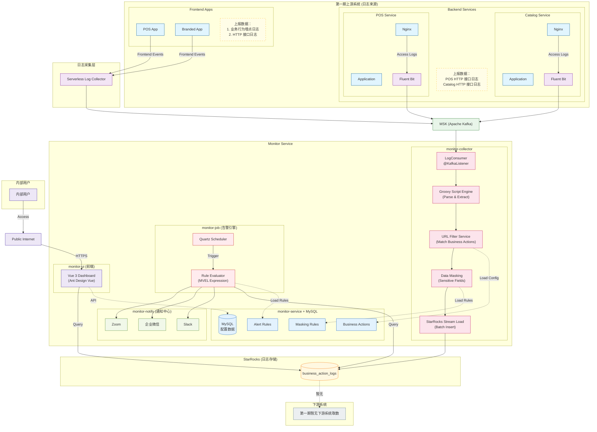

# Monitor 系统：架构图

**更新日期**：2026-01-18

---

## 系统架构 (Mermaid)

---

## 第一期范围说明

### 1.1 上游系统 (日志来源)

| 上游系统 | Kafka Topic | 日志类型 | 说明 |
|----------|-------------|----------|------|
| Catalog Service | monitor.log.catalog | Nginx Access Log | 目录服务HTTP请求日志 |
| POS Service | monitor.log.pos | Nginx Access Log | POS服务HTTP请求日志 |
| POS App / Branded App | monitor.log.pos-app | Frontend Events | 前端埋点事件日志 |

### 1.2 下游系统 (数据消费)

| 下游系统 | 取数方式 | 说明 |
|----------|----------|------|
| **第一期暂无** | - | 当前无其他系统从Monitor取数 |

> 如后续有下游系统需要取数，需评估数据脱敏策略及访问权限。

---

## 存储说明

| 表名 | 说明 |
|------|------|
| business_action_logs | 所有业务日志统一存储 |

---

## 模块说明

| 模块 | 说明 |
|------|------|
| monitor-collector | Kafka消费、日志解析、脱敏、写入StarRocks |
| monitor-service | 核心业务逻辑、配置管理、API接口 |
| monitor-job | Quartz定时任务、告警规则评估 |
| monitor-notify | 统一通知服务 (Slack/企业微信/Zoom) |
| monitor-ui | Vue 3 前端界面 |

## 数据流说明

1. **日志采集**: 上游服务 → Fluent Bit / Serverless Collector → Kafka
2. **日志处理**: Consumer → Groovy解析 → URL匹配 → 数据脱敏 → 批量写入
3. **存储**: 所有日志统一写入 business_action_logs 表
4. **告警触发**: Quartz定时 → 加载规则 → 查询日志 → 评估条件 → 多渠道通知
5. **数据查询**: Dashboard → API/直接查询 → StarRocks
