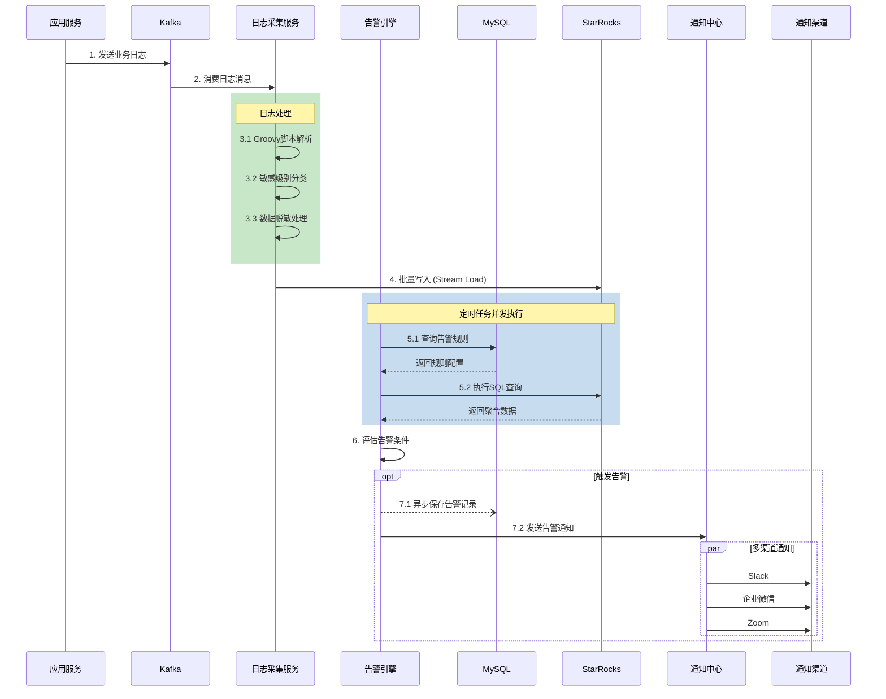

# Monitor 系统：服务交互时序图

**更新日期**：2026-01-18

---

## 日志采集与告警流程

### Mermaid 版本



### ZenUML 版本

```zenuml
// 定义参与者
Application as "应用服务"
Kafka as "Kafka"
LogCollector as "日志采集服务"
AlertEngine as "告警引擎"
MySQL as "MySQL"
StarRocks as "StarRocks"
NotificationHub as "通知中心"

// 日志采集流程
Application->Kafka.发送业务日志()
Kafka->LogCollector.消费日志消息() {
  LogCollector->LogCollector.Groovy脚本解析()
  LogCollector->LogCollector.敏感级别分类()
  LogCollector->LogCollector.数据脱敏处理()
}
LogCollector->StarRocks.批量写入()

// 告警流程
par {
  AlertEngine->MySQL.查询告警规则() {
    return 规则配置
  }
  AlertEngine->StarRocks.执行SQL查询() {
    return 聚合数据
  }
}

AlertEngine->AlertEngine.评估告警条件()

opt {
  AlertEngine->MySQL.保存告警记录() async
  AlertEngine->NotificationHub.发送告警通知() {
    par {
      NotificationHub->Slack.发送()
      NotificationHub->企业微信.发送()
      NotificationHub->Zoom.发送()
    }
  }
}
```

---

## 参与者说明

| 参与者 | 模块 | 说明 |
|--------|------|------|
| 应用服务 | - | 上游业务系统 (POS、Catalog等) |
| Kafka | AWS MSK | 托管消息队列 |
| 日志采集服务 | monitor-collector | Kafka消费者，日志解析与写入 |
| 告警引擎 | monitor-job | Quartz定时任务，规则评估 |
| MySQL | - | 配置数据库 (规则、脱敏配置等) |
| StarRocks | - | OLAP日志数据库 |
| 通知中心 | monitor-notify | 统一通知服务 |
| 通知渠道 | - | Slack / 企业微信 / Zoom |

---

## 语法说明

### Mermaid
- `->>` 同步消息
- `-->>` 返回响应
- `--)` 异步消息
- `rect rgb()` 分组框
- `par` 并行执行
- `opt` 可选流程

### ZenUML
- `A->B.method()` 同步调用
- `return` 返回值
- `async` 异步调用
- `par { }` 并行执行
- `opt { }` 可选流程
