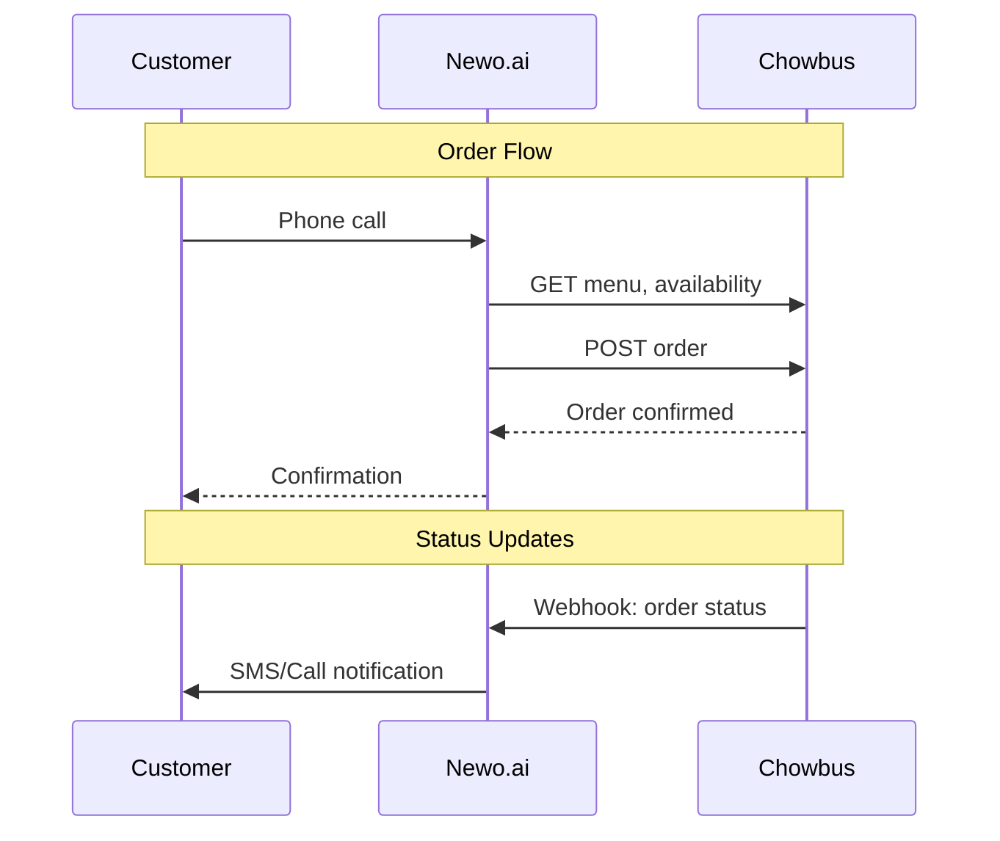
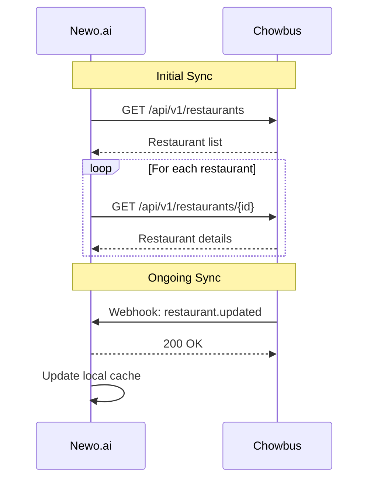
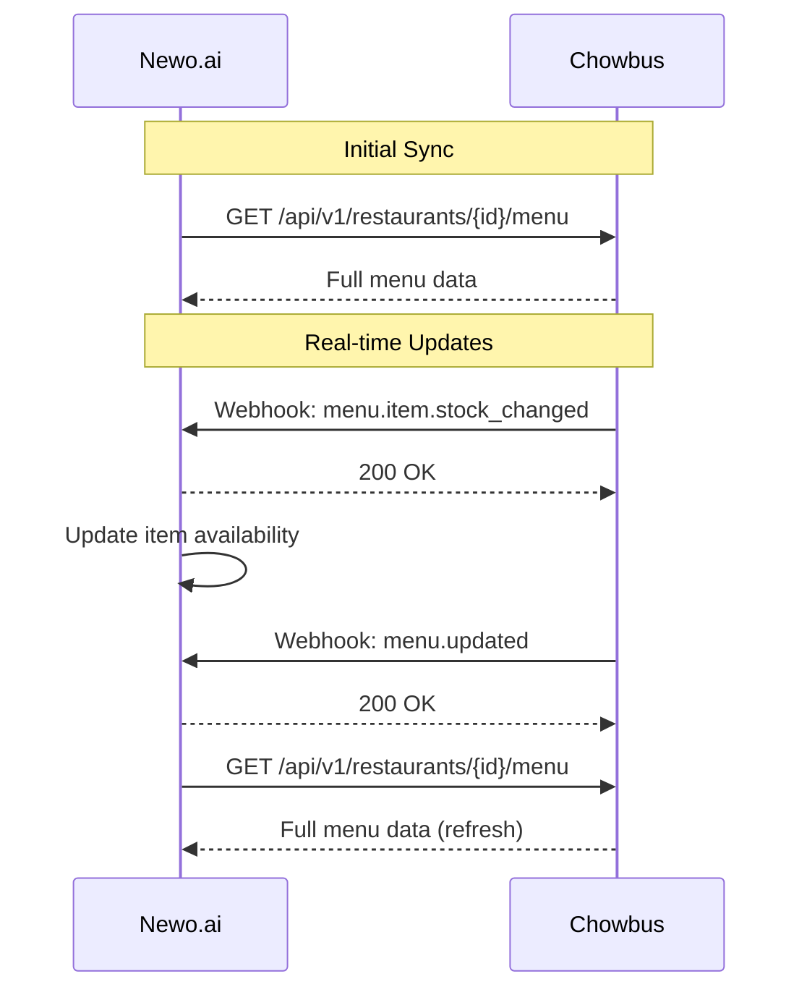
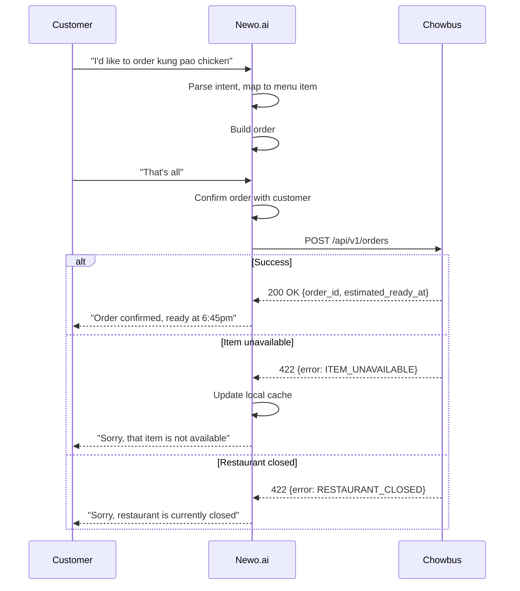
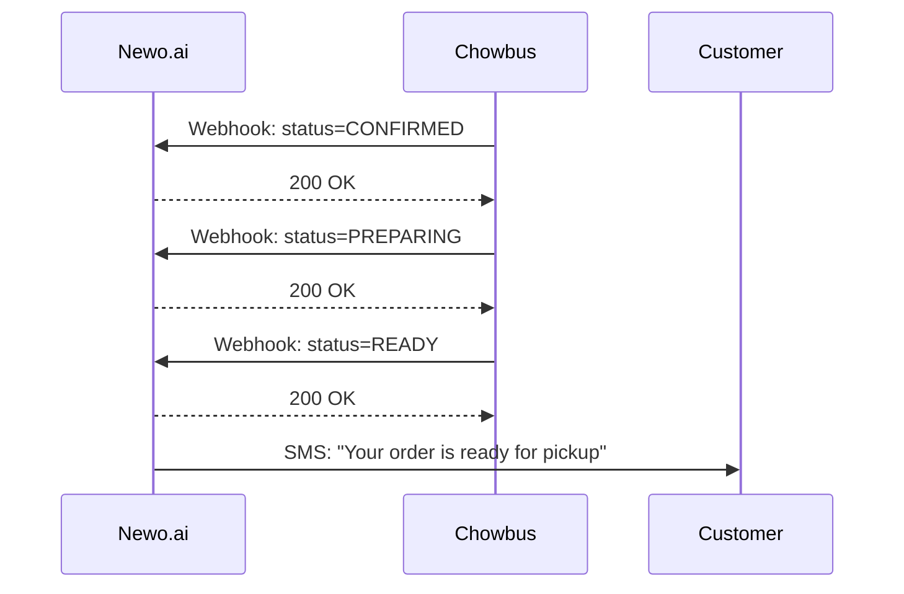
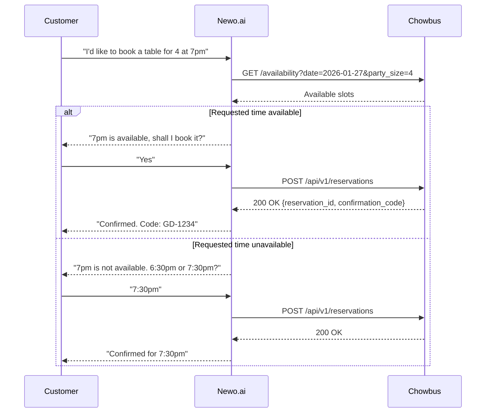
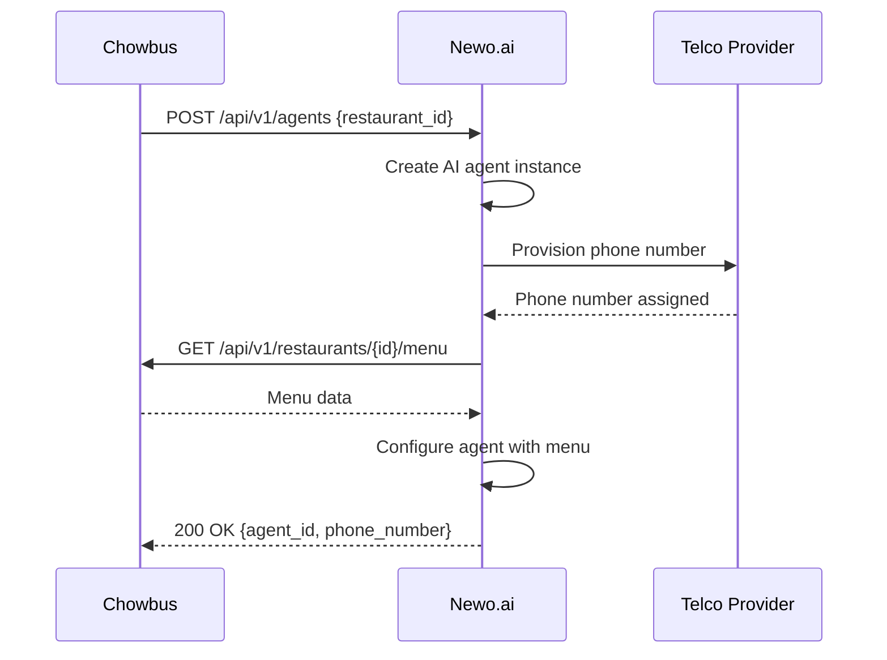

# Chowbus - Newo.ai Technical Requirements

> Technical specifications for AI Call Agent integration with Chowbus POS

---

## 1. Integration Overview

### System Interaction



### Integration Points

| Component | Direction | Method |
|-----------|-----------|--------|
| Restaurant Info | Chowbus → Newo.ai | REST API + Webhook |
| Menu/Catalog | Chowbus → Newo.ai | REST API + Webhook |
| Order Placement | Newo.ai → Chowbus | REST API |
| Order Status | Chowbus → Newo.ai | Webhook |
| Reservation | Newo.ai → Chowbus | REST API |
| Reservation Status | Chowbus → Newo.ai | Webhook |

---

## 2. API Requirements

### 2.1 Authentication

Newo.ai authenticates to Chowbus API using Bearer token:

```http
Authorization: Bearer {secret_key}
```

- Chowbus provides secret key per environment (sandbox, production)
- Keys must be stored securely (not in code repositories)
- Key rotation supported with 24-hour grace period

### 2.2 Chowbus APIs (Newo.ai consumes)

| API | Method | Endpoint | Purpose |
|-----|--------|----------|---------|
| List Restaurants | GET | `/api/v1/restaurants` | Get enabled restaurants |
| Get Restaurant | GET | `/api/v1/restaurants/{id}` | Restaurant details, hours |
| Get Menu | GET | `/api/v1/restaurants/{id}/menu` | Full menu with modifiers |
| Create Order | POST | `/api/v1/orders` | Submit order |
| Get Order | GET | `/api/v1/orders/{id}` | Check order status |
| Check Availability | GET | `/api/v1/restaurants/{id}/availability` | Table availability |
| Create Reservation | POST | `/api/v1/reservations` | Book table |
| Cancel Reservation | DELETE | `/api/v1/reservations/{id}` | Cancel booking |
| Register Webhook | POST | `/api/v1/webhooks` | Subscribe to events |

### 2.3 Newo.ai APIs (Chowbus consumes)

| API | Method | Endpoint | Purpose |
|-----|--------|----------|---------|
| Create Agent | POST | `/api/v1/agents` | One-Click Creator |
| Update Agent | PATCH | `/api/v1/agents/{id}` | Update agent config |
| Delete Agent | DELETE | `/api/v1/agents/{id}` | Remove agent |
| Get Agent Status | GET | `/api/v1/agents/{id}` | Agent health/status |
| List Agents | GET | `/api/v1/agents` | All agents for account |
| Get Call Logs | GET | `/api/v1/agents/{id}/calls` | Call history |
| Get Metrics | GET | `/api/v1/agents/{id}/metrics` | Usage metrics |

### 2.4 Webhook Events (Chowbus → Newo.ai)

Newo.ai must implement webhook receiver for:

| Event | Trigger | Required |
|-------|---------|----------|
| `restaurant.updated` | Restaurant info changed | Yes |
| `restaurant.hours_changed` | Hours modified | Yes |
| `restaurant.closed_temporarily` | Temporary closure | Yes |
| `menu.updated` | Menu structure changed | Yes |
| `menu.item.updated` | Item details changed | Yes |
| `menu.item.stock_changed` | Item availability changed | Yes |
| `order.status_changed` | Order status updated | Yes |
| `order.cancelled` | Order cancelled | Yes |
| `reservation.confirmed` | Reservation confirmed | Yes |
| `reservation.cancelled` | Reservation cancelled | Yes |

---

## 3. Data Sync Requirements

### 3.1 Restaurant/Location Sync



**Requirements:**
- Initial full sync on agent creation
- Process webhooks within 5 seconds
- Daily reconciliation sync recommended

### 3.2 Menu/Catalog Sync



**Requirements:**
- Sync full menu on agent creation
- Handle `menu.item.stock_changed` for real-time 86'd items
- Re-fetch full menu on `menu.updated` event
- Menu cache TTL: max 1 hour (with webhook updates)

### 3.3 Sync Latency Requirements

| Data Type | Max Sync Latency |
|-----------|------------------|
| Item stock change (86'd) | 30 seconds |
| Price change | 5 minutes |
| Menu structure change | 5 minutes |
| Restaurant hours change | 5 minutes |
| Restaurant closure | 30 seconds |

---

## 4. Order Flow Requirements

### 4.1 Order Placement



### 4.2 Order Request Format

```json
{
  "restaurant_id": "rest_01HXYZ",
  "order_type": "PICKUP",
  "fulfillment": {
    "mode": "ASAP"
  },
  "customer": {
    "name": "John Doe",
    "phone": "+1-555-123-4567"
  },
  "items": [
    {
      "item_id": "item_01ABC",
      "quantity": 2,
      "modifiers": [
        {"modifier_id": "mod_01", "quantity": 1}
      ],
      "special_instructions": "Extra spicy"
    }
  ],
  "payment": {
    "method": "PARTNER_MANAGED",
    "partner_transaction_id": "newo_txn_123"
  },
  "idempotency_key": "newo_order_uuid_here"
}
```

### 4.3 Order Status Updates



### 4.4 Error Handling

| Error | Newo.ai Action |
|-------|----------------|
| `ITEM_UNAVAILABLE` | Inform customer, suggest alternatives, update cache |
| `RESTAURANT_CLOSED` | Inform customer, offer scheduled order if available |
| `INVALID_MODIFIERS` | Inform customer, re-collect modifier selection |
| `DUPLICATE_ORDER` | Treat as success (idempotent), return existing order |
| Network timeout | Retry up to 3 times with exponential backoff |
| 5xx error | Retry up to 3 times, then escalate to human |

---

## 5. Reservation Flow Requirements

### 5.1 Reservation Placement



---

## 6. One-Click Creator Requirements

### 6.1 Agent Provisioning Flow



### 6.2 Provisioning Requirements

| Step | Max Duration |
|------|--------------|
| Agent creation | 30 seconds |
| Phone number provisioning | 2 minutes |
| Menu sync | 1 minute |
| Total time to live | 5 minutes |

### 6.3 Agent Configuration

Newo.ai agent must be configurable for:

| Setting | Description |
|---------|-------------|
| Restaurant name | How AI introduces the restaurant |
| Operating hours | When to accept calls vs. send to voicemail |
| Supported order types | PICKUP, DINE_IN |
| Languages | Primary and secondary language |
| Escalation number | Fallback for human handoff |
| Greeting script | Custom greeting message |
| Closing script | Custom closing message |

---

## 7. Service Level Requirements

### 7.1 Availability

| Service | Target Uptime |
|---------|---------------|
| Newo.ai AI Agent | 99.9% |
| Newo.ai API | 99.9% |
| Phone number service | 99.99% |

### 7.2 Performance

| Metric | Target |
|--------|--------|
| AI response latency (voice) | < 1.5 seconds |
| Order submission to Chowbus | < 2 seconds |
| Webhook processing | < 5 seconds |
| Agent provisioning | < 5 minutes |

### 7.3 Accuracy

| Metric | Target |
|--------|--------|
| Speech recognition accuracy | > 95% |
| Order accuracy (items correct) | > 99% |
| Intent recognition | > 95% |

---

## 8. Data Requirements

### 8.1 Data Newo.ai Receives from Chowbus

| Data | Purpose | Retention |
|------|---------|-----------|
| Restaurant info | Agent configuration | Duration of service |
| Menu data | Order taking | Duration of service |
| Order status | Customer notification | 90 days |

### 8.2 Data Newo.ai Sends to Chowbus

| Data | Purpose | Format |
|------|---------|--------|
| Order details | Order placement | JSON via API |
| Customer info | Order fulfillment | JSON via API |
| Reservation details | Table booking | JSON via API |

### 8.3 Data Newo.ai Retains

| Data | Retention | Purpose |
|------|-----------|---------|
| Call recordings | 90 days | Quality, disputes |
| Call transcripts | 90 days | Quality, disputes |
| Order logs | 90 days | Reconciliation |

---

## 9. Security Requirements

### 9.1 API Security

- TLS 1.2+ for all API communication
- API keys rotated every 90 days
- Rate limiting: 1000 requests/minute per restaurant

### 9.2 Webhook Security

- HMAC-SHA256 signature verification
- Replay protection (timestamp validation)
- IP allowlist option available

### 9.3 Data Security

- Encryption at rest (AES-256)
- Encryption in transit (TLS 1.2+)
- No storage of payment card data (PCI scope excluded)

---

## 10. Testing Requirements

### 10.1 Sandbox Environment

- Chowbus provides sandbox API with test restaurants
- Test phone numbers for end-to-end testing
- Simulated webhook events

### 10.2 Test Scenarios

| Scenario | Expected Behavior |
|----------|-------------------|
| Successful order | Order created, confirmation returned |
| Item out of stock | 422 error, graceful customer handling |
| Restaurant closed | 422 error, inform customer |
| Network failure | Retry with backoff, escalate if persistent |
| Menu update during call | Complete current order, sync after |
| High volume (10 concurrent calls) | All calls handled within SLA |

### 10.3 Go-Live Checklist

- [ ] All APIs integrated and tested
- [ ] Webhook receiver operational
- [ ] Error handling verified
- [ ] Menu sync verified
- [ ] Order flow end-to-end tested
- [ ] Reservation flow tested (if applicable)
- [ ] Phone number provisioned and tested
- [ ] Escalation path configured and tested
- [ ] Monitoring and alerting configured
