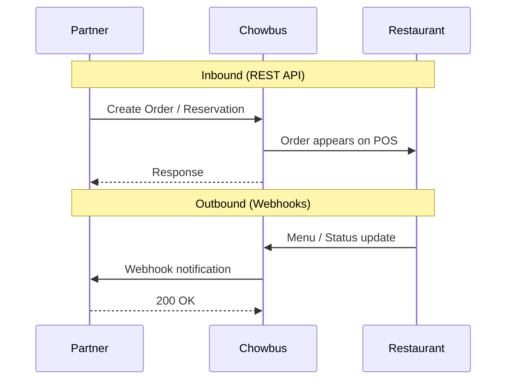
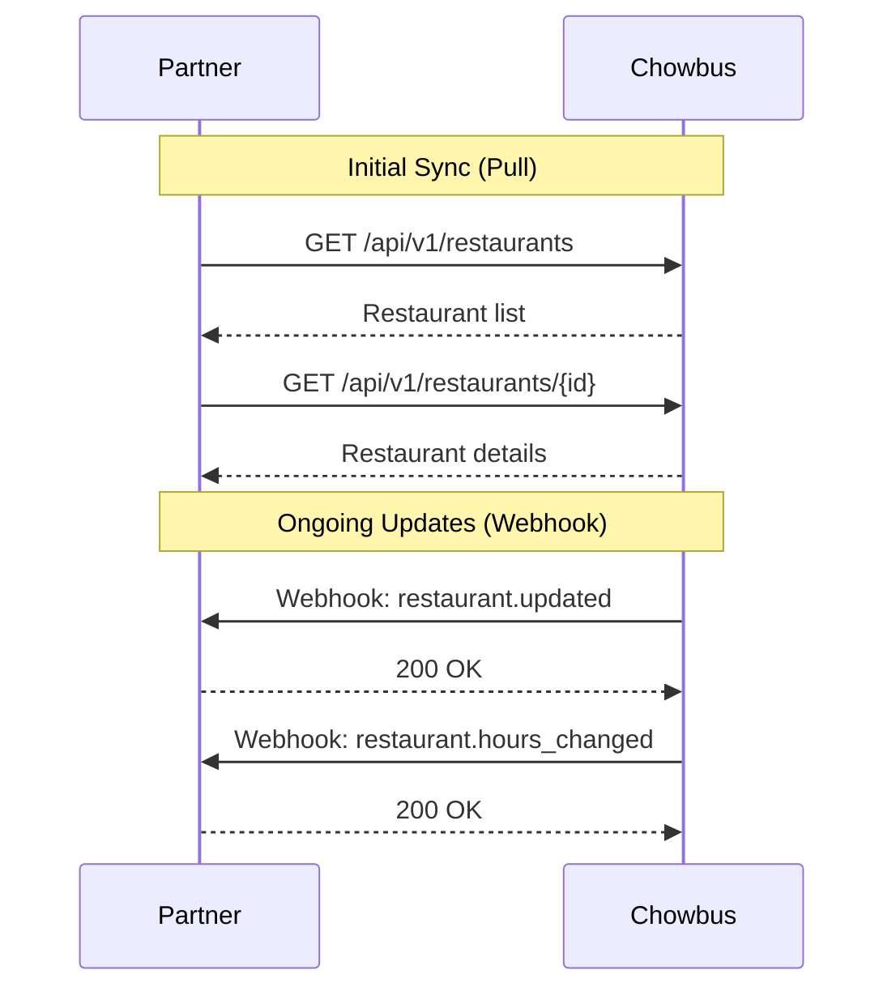
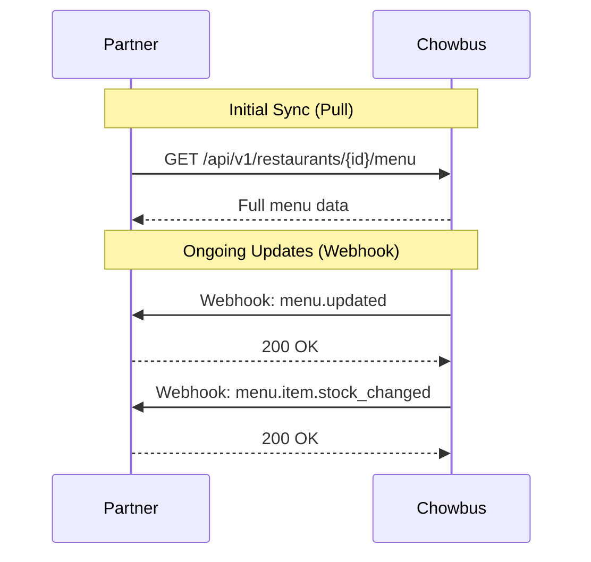
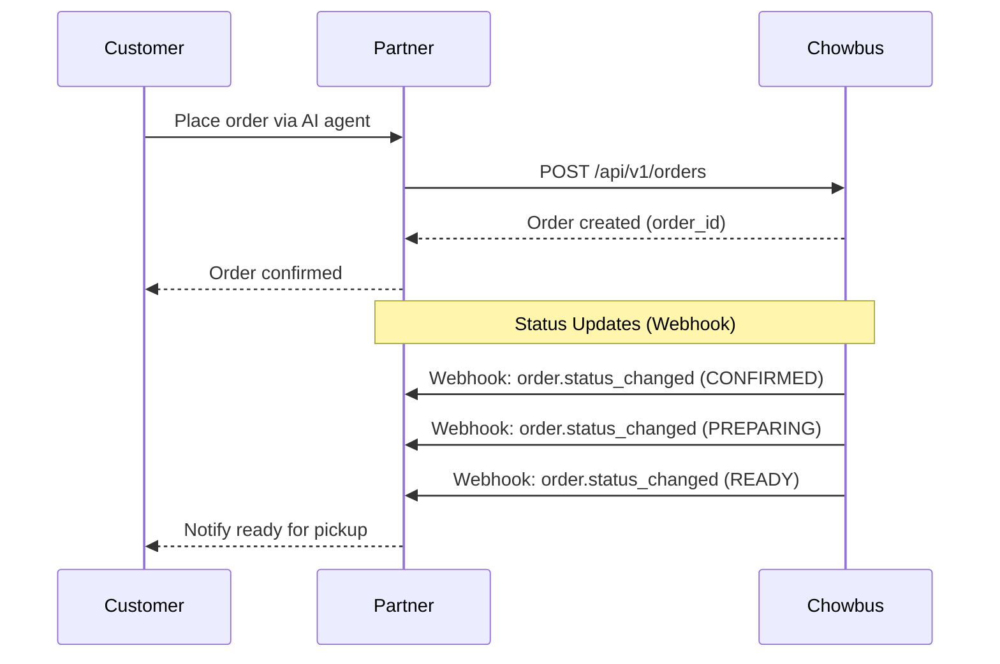
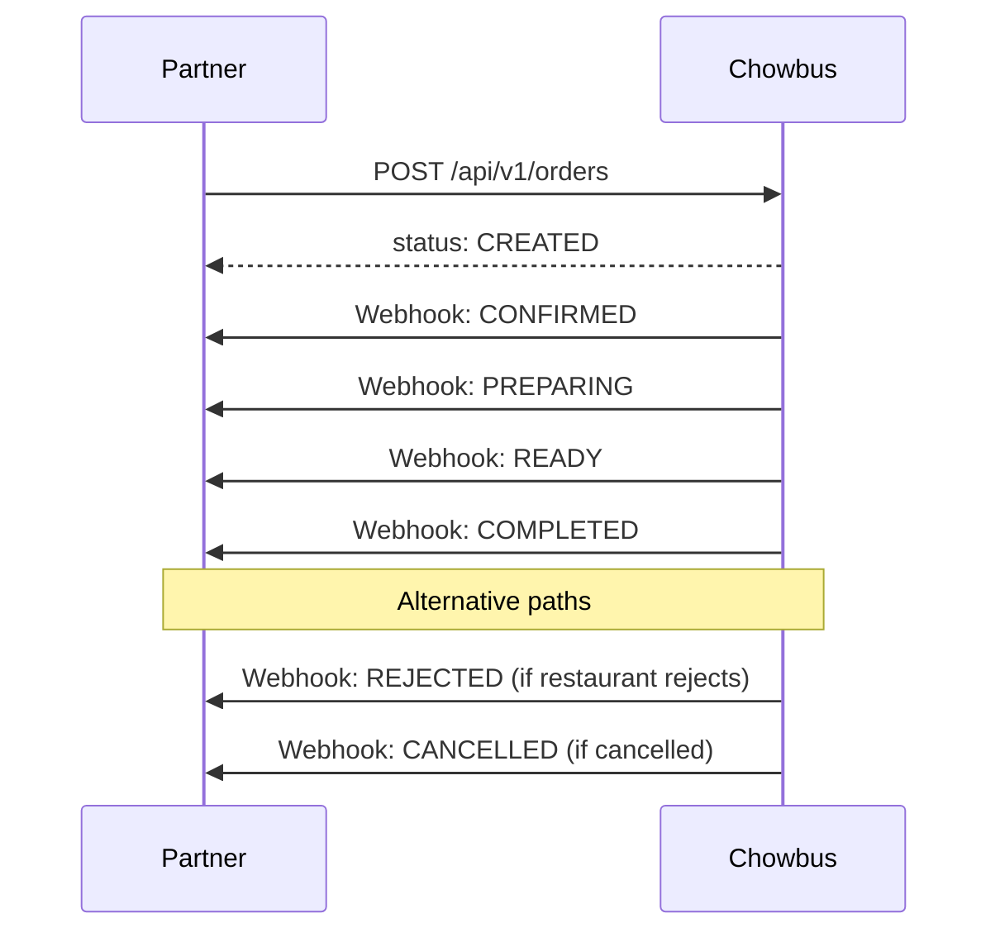
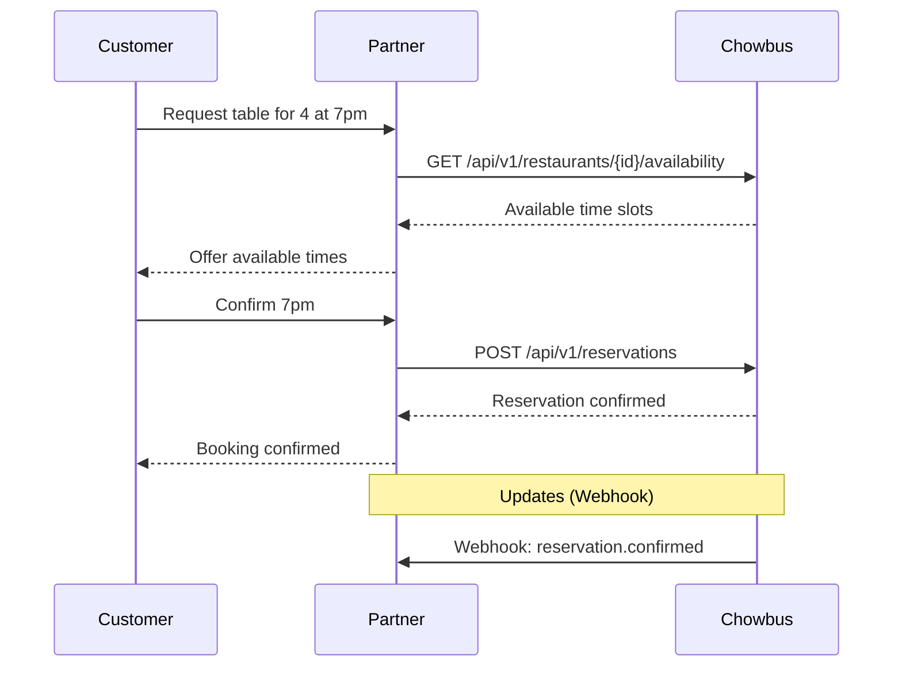

# Chowbus Partner Integration API

> Technical integration guide for AI call agent partners to integrate with Chowbus restaurant POS platform.

**Version**: 1.0
**Last Updated**: January 2026

---

## Table of Contents

1. [System Overview](#1-system-overview)
2. [Authentication](#2-authentication)
3. [Location/Restaurant Info](#3-locationrestaurant-info)
4. [Catalog/Menu Sync](#4-catalogmenu-sync)
5. [Order Placement](#5-order-placement)
6. [Reservations](#6-reservations)
7. [API Checklist](#7-api-checklist)

---

## 1. System Overview

### Components

| Component | Description | Direction |
|-----------|-------------|-----------|
| **Authentication** | Bearer token for API access | Partner → Chowbus |
| **Location Info** | Restaurant details, hours, capabilities | Chowbus → Partner |
| **Catalog** | Menu items, pricing, availability | Chowbus → Partner |
| **Orders** | Order creation and status updates | Bidirectional |
| **Reservations** | Table availability and booking | Bidirectional |

### High-Level System Flow



---

## 2. Authentication

### Method

Bearer token in `Authorization` header.

```http
Authorization: Bearer {secret_key}
```

### Example

```bash
curl https://api.chowbus.com/api/v1/restaurants \
  -H "Authorization: Bearer {secret_key}"
```

---

## 3. Location/Restaurant Info

### Flow



### Restaurant Model

```json
{
  "id": "rest_01HXYZ",
  "name": "Golden Dragon",
  "address": {
    "street": "123 Main St",
    "city": "Chicago",
    "state": "IL",
    "zip": "60601"
  },
  "phone": "+1-312-555-0123",
  "timezone": "America/Chicago",
  "operating_hours": {
    "monday": [{"open": "11:00", "close": "21:00"}],
    "tuesday": [{"open": "11:00", "close": "21:00"}]
  },
  "capabilities": {
    "pickup": true,
    "dine_in": true,
    "reservations": true
  }
}
```

### Webhook Events

| Event | Description |
|-------|-------------|
| `restaurant.updated` | Restaurant details changed |
| `restaurant.hours_changed` | Operating hours modified |
| `restaurant.closed_temporarily` | Temporary closure |

---

## 4. Catalog/Menu Sync

### Flow



### Menu Model

```json
{
  "id": "menu_01ABC",
  "restaurant_id": "rest_01HXYZ",
  "categories": [
    {
      "id": "cat_01",
      "name": "Appetizers",
      "sort_order": 1,
      "items": [
        {
          "id": "item_01ABC",
          "name": "Spring Rolls",
          "description": "Crispy vegetable rolls",
          "price_cents": 899,
          "image_url": "https://...",
          "available": true,
          "in_stock": true,
          "modifier_groups": [
            {
              "id": "mg_01",
              "name": "Sauce",
              "required": false,
              "min_select": 0,
              "max_select": 2,
              "modifiers": [
                {
                  "id": "mod_01",
                  "name": "Sweet Chili",
                  "price_cents": 0,
                  "available": true
                }
              ]
            }
          ]
        }
      ]
    }
  ]
}
```

### Webhook Events

| Event | Description |
|-------|-------------|
| `menu.updated` | Full menu structure changed |
| `menu.item.updated` | Single item details changed |
| `menu.item.stock_changed` | Item availability/stock changed |

---

## 5. Order Placement

### Flow



### Order Status Lifecycle



### Order Request Model

```json
{
  "restaurant_id": "rest_01HXYZ",
  "order_type": "PICKUP",
  "fulfillment": {
    "mode": "ASAP"
  },
  "customer": {
    "name": "John Doe",
    "phone": "+1-555-123-4567"
  },
  "items": [
    {
      "item_id": "item_01ABC",
      "quantity": 2,
      "modifiers": [
        {"modifier_id": "mod_01", "quantity": 1}
      ],
      "special_instructions": "Extra spicy"
    }
  ],
  "payment": {
    "method": "PARTNER_MANAGED",
    "partner_transaction_id": "txn_123"
  },
  "idempotency_key": "unique-request-id"
}
```

### Order Response Model

```json
{
  "order_id": "order_01MNOP",
  "status": "CREATED",
  "estimated_ready_at": "2026-01-27T18:45:00Z",
  "total_cents": 2598
}
```

### Order Types

| Type | Description |
|------|-------------|
| `PICKUP` | Customer picks up at restaurant |
| `DINE_IN` | Customer dining in restaurant |

### Fulfillment Modes

| Mode | Description |
|------|-------------|
| `ASAP` | Immediate preparation |
| `SCHEDULED` | Scheduled for future time (include `scheduled_at`) |

### Webhook Events

| Event | Description |
|-------|-------------|
| `order.status_changed` | Order status updated |
| `order.cancelled` | Order was cancelled |

---

## 6. Reservations

### Flow



### Availability Request

```
GET /api/v1/restaurants/{restaurant_id}/availability?date=2026-01-27&party_size=4&time_from=18:00&time_to=20:00
```

### Availability Response Model

```json
{
  "restaurant_id": "rest_01HXYZ",
  "date": "2026-01-27",
  "party_size": 4,
  "available_slots": [
    {"time": "18:00", "available": true},
    {"time": "18:30", "available": true},
    {"time": "19:00", "available": true},
    {"time": "19:30", "available": false}
  ]
}
```

### Reservation Request Model

```json
{
  "restaurant_id": "rest_01HXYZ",
  "date": "2026-01-27",
  "time": "19:00",
  "party_size": 4,
  "customer": {
    "name": "Jane Smith",
    "phone": "+1-555-987-6543"
  },
  "special_requests": "Birthday celebration",
  "idempotency_key": "unique-reservation-id"
}
```

### Reservation Response Model

```json
{
  "reservation_id": "res_01QRST",
  "status": "CONFIRMED",
  "confirmation_code": "GD-1234",
  "datetime": "2026-01-27T19:00:00-06:00",
  "party_size": 4
}
```

### Webhook Events

| Event | Description |
|-------|-------------|
| `reservation.confirmed` | Reservation confirmed |
| `reservation.modified` | Reservation changed |
| `reservation.cancelled` | Reservation cancelled |

---

## 7. API Checklist

### REST APIs (Partner → Chowbus)

| API | Method | Endpoint | Purpose |
|-----|--------|----------|---------|
| List Restaurants | GET | `/api/v1/restaurants` | Get enabled restaurants |
| Get Restaurant | GET | `/api/v1/restaurants/{id}` | Get restaurant details |
| Get Menu | GET | `/api/v1/restaurants/{id}/menu` | Get full menu |
| Create Order | POST | `/api/v1/orders` | Place new order |
| Get Order | GET | `/api/v1/orders/{id}` | Get order status |
| Check Availability | GET | `/api/v1/restaurants/{id}/availability` | Get table slots |
| Create Reservation | POST | `/api/v1/reservations` | Book a table |
| Cancel Reservation | DELETE | `/api/v1/reservations/{id}` | Cancel booking |

### Webhooks (Chowbus → Partner)

| Category | Events |
|----------|--------|
| **Restaurant** | `restaurant.updated`, `restaurant.hours_changed`, `restaurant.closed_temporarily` |
| **Menu** | `menu.updated`, `menu.item.updated`, `menu.item.stock_changed` |
| **Order** | `order.status_changed`, `order.cancelled` |
| **Reservation** | `reservation.confirmed`, `reservation.modified`, `reservation.cancelled` |

### Webhook Registration

```
POST /api/v1/webhooks
```

```json
{
  "url": "https://partner.example.com/webhooks/chowbus",
  "events": ["menu.updated", "order.status_changed", "restaurant.updated"],
  "secret": "webhook_signing_secret"
}
```

### Models Summary

| Model | Used In |
|-------|---------|
| Restaurant | Location info endpoints |
| Menu / Category / Item / Modifier | Catalog endpoints |
| Order / OrderItem | Order endpoints |
| Reservation | Reservation endpoints |
| Webhook Payload | All webhook events |

### Error Codes

| Code | HTTP Status | Description |
|------|-------------|-------------|
| `AUTHENTICATION_FAILED` | 401 | Invalid API key |
| `INVALID_REQUEST` | 400 | Malformed request |
| `ITEM_UNAVAILABLE` | 422 | Item out of stock |
| `RESTAURANT_CLOSED` | 422 | Not accepting orders |
| `DUPLICATE_ORDER` | 409 | Idempotency key reused |
| `NOT_FOUND` | 404 | Resource not found |

---

## Support

| Issue Type | Contact |
|------------|---------|
| Technical Integration | partner-tech@chowbus.com |
| Production Issues | oncall@chowbus.com |
